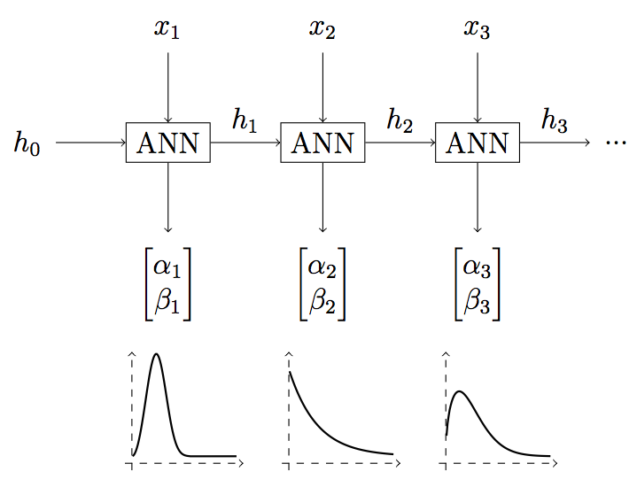

# WTTE-RNN
Weibull Time to Event Reccurent Neural Network

A less hacky machine-learning framework for churn- and time to event prediction. Forecasting problems as diverse as server monitoring to earthquake- and churn-prediction can be posed as the problem of predicting the time to an event. WTTE-RNN is an algorithm and a philosophy about how this should be done. 

* [blog post](https://ragulpr.github.io/2016/12/22/WTTE-RNN-Hackless-churn-modeling/) 
* [master thesis](https://ragulpr.github.io/assets/draft_master_thesis_martinsson_egil_wtte_rnn_2016.pdf)
* Quick visual intro to the [model](https://imgur.com/a/HX4KQ) 

## Why it's cool
We assume data of many time-series of events were we want to use historic data to predict the time to the next event (TTE). If we haven't observed the last event yet we only have the minimum of the tte to train on. This is called *censored data* (in red):

Instead of predicting the tte itself the trick is to let your machine learning model output the *parameters of a distribution*. This could be any machine learning model but we like RNNs:

One could use any distribution but we like the *Weibull distribution* because it's [awesome](https://ragulpr.github.io/2016/12/22/WTTE-RNN-Hackless-churn-modeling/#embrace-the-weibull-euphoria) but I hope to see many extensions. We train the algos with a special log-loss for censored data. 

In essence, we want to assign high probability at the *next* event and low probability where there *wasn't* any events (censored data): 

What we get is a pretty neat prediction about the *distribution of the tte* in each step. A neat sideresult is a 2-d embedding that can be used to visualize *when* (alpha) and *how sure we are* (beta):

# ROADMAP
The project is on the TODO-state. The goal is to create a forkable and easily deployable model framework. WTTE-RNN is the algorithm, churn_watch is the deployment - an opinionated idea about how churn-monitoring and reporting can be made beautiful and easy. 

## Implementations of the objective functions
The core technology is the objective functions. These can be used with any machine-learning algorithm. To spread the word we should implement and commit them to various ML-projects. 

* Tensorflow (Done but not implemented as raw op yet)
* MXnet
* Theano
* Keras
* TORCH
* H2o
* scikitFlow
* MLlib

## Auxiliary

To use the model one needs basic tte-transforms of raw data. To consume the models we need weibull related functions for the final output.
* Ready to run helper functions implemented in SQL, R, Python
  - get_time_to_event (calculates tte and censored tte)
  - get_is_censored
  - weibull hazard, chf, cdf, pdf, quantile, expected value etc (Python done). 

## Monitoring 
The WTTE-RNN is as much an ML-algorithm as a visual language to talk about this shape of data and our predictions.
* Plots (partly done)
* Shiny webapp or/and similar (partly done elsewhere)
* Integration. Slack/E-mail bots & summaries
* API 

## Models
To get this going we need at least one off-the-shelf deep-learning implementation that scales. Currently there's one that doesn't.
* Best-practices WTTE-RNN implementation

## Deployment
* Notebooks
* Containers
* IBM project?
* Cortana project?

# Licensing
* MIT-license. 

# Citation

	@MastersThesis{martinsson:Thesis:2016,
	    author     =     {Egil Martinsson},
	    title     =     {WTTE-RNN : Weibull Time To Event Recurrent Neural Network},
	    school     =     {Chalmers University Of Technology},
	    year     =     {2016},
	    }

Reach out to egil.martinsson[at]gmail.com if you have any questions!
